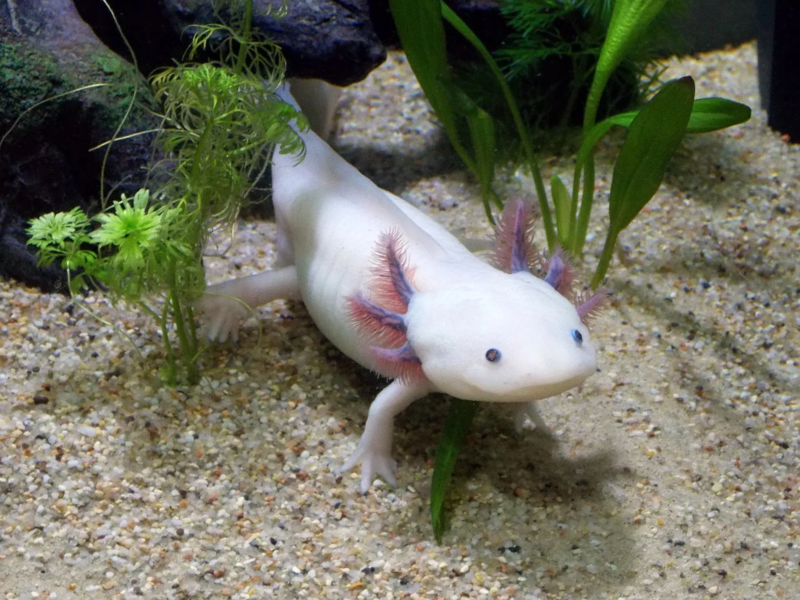

# axol



* Axolotl is a cute amphibian which can [regrow](https://en.wikipedia.org/wiki/Axolotl#Regeneration) missing body parts.
* Axol is a minimalist programming language simple to read, write, extend.
* It aims for a great user experience with as few core elements as possible, just as the vast diversity of atoms arises from only three particles: protons, neutrons, and electrons.
* Core elements of axol: `"strings"`, numbers, `[boxes]`, and `{functions}`.

axol version 0.4.25

# core

## string

```
print("hello world")
# hello world

a=1
print(a)
# 1

b="c"
print("{a}d{b}")
# 1dc

print("e\"f\{g\}h\\i\
  j
  k"
)
# e"f{g}h\ij
#   k

print("""
  e"f{g}h\ij
    k
""")
# e"f{g}h\ij
#   k

print(
  """
    l
    """
    m
  """
)
# l
# """
# m

print(
  "
    n
    \"
    o
  "
)
#
#   n
#   "
#   o
#

print(
  "p
    {b}
  q"
)
# p
#   c
# q
```

## number

```
print(-3.14)
# -3.14
```

## box

```
b=["c" "d" "e" f="g" h="i"]

print(b)
# ["c" "d" "e" f="g" h="i"]

print(b.0 b.1 b.2 b.f b.h)
#     c   d   e   g   i

[pos=[j k l] kv=[f h]]=b
print(j k l f h)
#     c d e g i

[
  pos=[j k l u="v"]
  kv=[f h="w" x="y"]
]=b
print(j k l u f h x)
#     c d e v g i y

[pos=[j]]=b
# Error: pos=[j] cannot unbox pos=["c" "d" "e"], try pos=[j vals...]

[pos=[j m...]]=b
# Error: kv=[] cannot unbox kv=[f="g" h="i"], try kv=[kvals...]

[pos=[j m...] kv=[n...]]=b
print(j m n)
# c ["d" "e"] [f="g" h="i"]

print([j m... n...])
# ["c" "d" "e" f="g" h="i"]

print([o="p" o="q"])
# [o="q"]
```

See also: [box functions](#box-functions), [$call](#call), [$str](#str).

## function

```
f={a}

a="b"

print(f())
# b

print(f)
# {"f"}

print([f=f])
# [f={}]
```

Function [$outer.key](#outer) is printed instead of a usually long function code.

`f={"f"}` is printed as `f={}` for brevity.

### $

`$` is a box with the arguments the function was called with.

```
dup={
  val=$.0
  "{val}{val}"
}

print(dup("he"))
# hehe

greet={
  [pos=[name] kv=[how="hello"]]=$
  print("{how}, {name}!")
}

greet("Alice")
# hello, Alice!

greet("Bob" how="hi")
# hi, Bob!

echo={print($)}

echo("a" "b" c="d")
# ["a" "b" c="d"]

"a"|echo("b" c="d")
# ["a" "b" c="d"]

"a"|echo
# ["a"]
```

While valid, one-liner functions are less readable:

```
{val=$.0 "{val}{val}"}("no")
# nono
```

### $me

`$me` is the last box the function was got from.

```
f={print($me)}

f()
# null

a=["b" f=f]
c=["d" f=f]

a.f()
# ["b" f={}]

c.f()
# ["d" f={}]

f2=a|get("F"|lower)
f2()
# ["b" f={}]
```

`$me` can be overridden, it's auto-deleted from the `$` box:

```
f($me=c)
# ["d" f={}]

e=["g" f={
  print($ $me)
}]

e.f(h="i")
# [h="i"] ["g" f={}]

e.f(j="k" $me=c)
# [j="k"] ["d" f={}]
```

See also: [oop](#oop).

### $here

`$here.box` is a box with keys and values set in the function.

```
a="b"

f={
  a="c"
  print($here.box)
}

f()
# [a="c"]

print($here.box)
# [a="b" f={}]
```

Special keys like `$here` itself are not printed to keep it clean, unlike `[a="b" f={} $here=[a="b" f={} $here=...]]`

### $outer

`$outer.box` is a [$here.box](#here) of a function that created the current function.

`$outer.key` is the first key the function was set to in the `$outer.box`.

```
a="b"
f={print($outer)}
true|then({
  a="c"
  r=f()
})
# [box=[a="b" f={}] key="f"]

{print($outer)}()
# [box=[a="b" f={}] key=null]
```

See also: [up](#up).

### $caller

`$caller.box` is a [$here.box](#here) of a function that called the current function.

`$caller.key` is the key the function result will be set to in the `$caller.box`.

```
a="b"
f={print($caller)}
true|then({
  a="c"
  r=f()
  f()
})
# [box=[a="c"] key="r"]
# [box=[a="c"] key=null]
```

See also: [up](#up), [throw](#throw), [Enum](#Enum).

### $call

`$call` allows to call its [$outer.box](#outer) like a function.

```
a=["b" c="d" $call={
  print($me.c)
}]

a()
# d
```

### $str

`$str` allows to convert its [$outer.box](#outer) to a string in a custom way.

```
b=[name="Bob" $str={
  "{$me.name} in the box"
}]

print(b)
# Bob in the box

b.name="Joe"
print("and {b} too")
# and Joe in the box too
```

See also: [Error](#Error)

# stdlib

## flow

### te

`te` reads as "then/else" or "ternary".

```
te={
  [pos=[cond thenVal elseVal]]=$
  if(cond
    then={thenVal}
    else={elseVal}
  )
}

print("foo"|te("yes" "no"))
# yes

print([]|te("yes" "no"))
# no
```

### if

```
if={
  [
    pos=[cond]
    kv=[then={} elif=[] else={}]
  ]=$
  native.ifThen(cond|bool {
    return(then() from=if)
  })
  native.ifThen(elif|bool {
    # This extra `ifThen` avoids eternal loop between this `if` and another `if` inside the `while`.
    while({elif} do={
      [pos=[cond then]]=elif|del(0 len=2)
      native.ifThen(cond|bool {
        return(then() from=if)
      })
    })
  })
  else()
}

if("cond1" then={
  print(1)
} elif=[{"cond2"} {
  print(2)
} {"cond3"} {
  print(3)
} {"cond4"} {
  print(4)
}] else={
  print(5)
})
# 1
# (try replacing "cond1" with "")

if(eq(sum(2 2) 4)
  then={print("ok")}
  else={print("why?")}
)
# ok

if(2|sum(2)|eq(4)
  then={"ok"}
  else={"why?"}
)|print
# ok

2|sum(2)|eq(4)|te("ok" "why?")|print
# ok
```

See also [from](#from) and [Error](#Error) for real `elif` examples.

### then

```
then={
  [pos=[cond do]]=$
  if(cond then=do else={cond})
}

2|sum(2)|eq(4)|then({
  print("ok")
})
# ok

print("a"|then({"b"}))
# b

print([]|then({"c"}))
# []
```

See also: [and](#bool).

### else

```
else={
  [pos=[cond do]]=$
  if(cond then={cond} else=do)
}

2|sum(2)|eq(4)|else({
  print("why?")
})

print("a"|else({"b"}))
# a

print([]|else({"c"}))
# c
```

See also: [or](#bool).

### case

```
case={
  [
    pos=[expected items...]
    kv=[else={}]
  ]=$
  while({items} do={
    [pos=[val action]]=items|del(0 len=2)
    val|eq(expected)|else(continue)
    result=action()
    return(result from=case)
  })
  else()
}

input("sure? (yes/no): ")|case(
  "yes" {db.delete(all=true)}
  "no" {print("no problem")}
  else={print("assuming \"no\"")}
)
```

See also: [input](#input).

### throw
### catch
### trace

```
throw={
  err=$
  err.$trace|else({
    err.$trace=native.getTraceId()
  })

  caller=$caller
  while({caller} do={
    caller.box.$isCatching|then({
      return(err from=catch)
    })
    up(caller=caller.box.$caller)
  })

  print(err|trace("") file=os.stderr)
  err|del("$trace")
  msg=if(err|pos|len|eq(1)|and(
    not(err|kv)
  ) then={err.0} else={err})
  print("Error: {msg}" file=os.stderr)
  os.exit(1)
}

catch={
  [pos=[do]]=$
  $isCatching=true
  do()
  return(null)
}

err=catch({
  print(1)
  throw("a" b="c")
  print(2)
})
# 1
print("finally")
# finally

print(err)
# ["a" b="c" $trace=12345]

trace={
  [pos=[err format=""]]=$
  traceId=err.$trace
  items=native.getTraceItems(traceId)
  case(format
    [] {items}
    "" {
      items|map({
        [kv=[path line col at]]=$.val
        "{path} L{line} C{col}
          {at}"
      })|join("
      ")
    }
    else={throw("""
      format should be [] or ""
    """)}
  )
}

print(err|trace([]))
# [
#   [path="/path/app.axol" line=42 col=1 at="err=catch({"]
#   [path="/path/app.axol" line=44 col=3 at="throw(\"a\" b=\"c\")"]
# ]

print(err|trace(""))
# /path/app.axol L42 C1
#   err=catch({
# /path/app.axol L44 C3
#   throw("a" b="c")

err2=catch({
  throw(err)
})
print(err2|eq(err))
# true

throw(err)
# /path/app.axol L42 C1
#   e=catch({
# /path/app.axol L44 C3
#   throw("a" b="c")
# Error: ["a" b="c"]

throw("one string only")
# (trace)
# Error: one string only

throw("anything" else="here")
# (trace)
# Error: ["anything" else="here"]
```

### loop

Result of a `do` iteration of a `loop` is ignored. Use `break(val)` to return a value from a loop.

```
loop={
  [pos=[do]]=$
  native.repeat({
    err=catch(do)
    err|then({
      [
        pos=[head=null vals...]
        kv=[from=do kvals...]
      ]=err
      from|eq(do)|else({err|throw})
      case(head
        break {
          return(vals.0 from=loop)
        }
        continue {}
        # `return` is handled natively by each `{}`
        else={err|throw}
      )
    })
  })
  null
}

loop({
  print("Press Ctrl+C to stop this")
})
```

See also: [break](#break), [continue](#continue), [return](#return).

### break
### continue
### return

```
break={
  [pos=[val=null] kv=[from=null]]=$
  from|then({
    throw(break val from=from)
  })
  throw(break val)
}

continue={
  [kv=[from=null]]=$
  from|then({
    throw(continue from=from)
  })
  throw(continue)
}

return={
  [pos=[val=null] kv=[from=null]]=$
  native.return(val from)
}

test={
  loop({
    line=input()
    line|else(break)
    line|case(
      "skip" continue
      "ret" {
        return("returned" from=test)
      }
    )
    print("{line}?")
  })
  "broken"
}
print(test())
# (try entering "skip", "ret", empty line, something else)
```

See also: [loop](#loop)

### while

```
while={
  [pos=[cond] kv=[do]]=$
  cond|is({})|else({
    throw("""
      replace while(condition)
      with while({condition})
      to check condition many times
    """)
  })
  loop({
    if(cond() then=do else=break)
  })
}

i=4
while({i} do={
  i|print(end=" ")
  up(i=i|sub(1))
})
# 4 3 2 1
```

### each

```
each={
  [pos=[items do]]=$
  # (more code from `pause` later)
  loop({
    key=null
    [
      pos=[found key val]
    ]=native.getNextItem(items key)
    found|else(break)
    do(key=key val=val)
  })
}

["a" "b" c="d"]|each({
  print($.key $.val)
})
# 0 a
# 1 b
# c d
```

See also `each` definition in [pause](#pause).

### map

```
map={
  [
    pos=[items do={$.val}]
    kv=[flat=false]
  ]=$
  results=[]
  $|each({
    results|add(do($...) flat=flat)
  })
  results
}

print("hey"|map)
# ["h" "e" "y"]

print("hey"|map({
  "{$.key}={$.val}"
}))
# ["0=h" "1=e" "2=y"]

print(["a" b="c"].map({
  $.val|upper
})|join("")
# AC

print("abc"|map({
  [$.key $.val]
} flat=true))
# [0 "a" 1 "b" 2 "c"]
```

### bool

```
# Ideally, extendable:
falses=[false null 0 "" [] {}]
bool={not($.0|in(falses))}

# ...but `in` calls `bool` for now,
# so this code avoids eternal loop:
bool={
  [pos=[val]]=$
  do={return(false from=bool)}
  native.ifThen(val|eq(false) do)
  native.ifThen(val|eq(null) do)
  native.ifThen(val|eq(0) do)
  native.ifThen(val|eq("") do)
  native.ifThen(val|eq([]) do)
  native.ifThen(val|eq({}) do)
  true
}

print([]|bool)
# false

print([""]|bool)
# true
```

### not

```
not={
  [pos=[val]]=$
  val|bool|eq(false)
}

print(not(true))
# false

print(not({}))
# true
```

### eq
### ne

```
eq={native.eq($...)}

print("a"|eq("a"))
# true

print("a"|eq("a" "A"|lower))
# true

print({}|eq({}))
# true

print({"a"}|eq({"a"}))
# false
# (non-empty functions are compared by their addresses as they may behave differently depending on `$outer` and `$caller`)

f={"a"}
print(f|eq(f))
# true

ne={not(eq($...))}

print([]|ne({}))
# true
```

### math

```
print(
  2|lt(3)  # Less Than
  2|lte(3)  # Less Than or Equal
  3|gt(2)  # Greater Than
  3|gte(2)  # Greater Than or Equal
)
# true
# (4 times)

print("a"|and("b"))
# "b"

print(""|and("b"))
# ""

print("a"|or("b"))
# "a"

print(""|or("b"))
# "b"

[sum sub mul div mod pow]|each({
  print($.val(3 2) end=" ")
})
# 5 1 6 1.5 1 9

min={
  [pos=[items] kv=[key={$.val}]]=$
  minItem=null
  minKey=null
  items|each({
    curItem=$.val
    curKey=key(curItem)
    minKey|eq(null)|or(
      minKey|gt(curKey)
    )|then({up(
      minItem=curItem
      minKey=curKey
    )})
  })
  minItem
}

max={
  # Similar to `min`.
}

a=[3 1 4]

a|min|print
# 1

a|max(key={
  0|sub($.val)
})|print
# 1
```

## box functions

See also: [box](#box), [each](#each), [map](#map).

### add

```
add={
  [
    pos=[box vals...]
    kv=[at=-1 flat=false]
  ]=$
  native.add(box vals at flat)
}

b=["a" c="d"]

b|add("h")
print(b)
# ["a" "h" c="d"]

b|add("k" "l" at=0)
print(b)
# ["k" "l" "a" "h" c="d"]

b=["a" c="d"]
b|add([
  "h" [i="j"]
  c="k" l="m"
] flat=true)
print(b)
# ["a" "h" [i="j"] c="k" l="m"]
```

### get

```
get={
  [
    pos=[box key]
    kv=[len=null default=null]
  ]=$
  hasDefault="default"|in($|keys)
  native.get(box key len hasDefault default)
}

a=["b" "c" "d" e="f"]

print(a|get(0))
# b

print(a|get(0 len=1))
# ["b"]

print(a|get(1 len=2))
# ["c" "d"]

print(a|get("E"|lower))
# f

print(a|get("g"))
# Error: `g` is not found

print(a|get("g" default=null))
# null

print(a.g)
# null
```

### set

```
set={
  [
    pos=[box key val]
    kv=[len=null]
  ]=$
  native.set(box key val len)
}

b=["a" "c" d="e"]

b|set("d" "x")
print(b)
# ["a" "c" d="x"]

b|set(0 len=2 ["g"])
print(b)
# ["g" d="x"]

f={print("complex")}
b|set(["key" j=f] "val")
b|get(["key" j=f])|print
# val

print(b)
# [
#   "g"
#   d="x"
#   ["key" j={"f"}]="val"
# ]
```

### up

```
up={
  [pos=[box=null] kv=[items...]]=$

  box|then({
    boxKeys=box|keys
    items|each({
      $.key|in(boxKeys)|else({
        throw(KeyError(key))
      })
    })
    items|each({
      [kv=[key val]]=$
      box|set(key val)
    })
    return
  })

  plan=[]
  callerOfUp=$caller
  items|each({
    [kv=[key val]]=$
    cur=[box=callerOfUp.box]
    while({not(
      key|in(cur.box|keys)
    )} do={
      outerBox=cur.box.$outer.box
      outerBox.else({
        throw(KeyError(key))
      })
      cur.box=outerBox
    })
    plan|add([
      box=cur.box
      key=key
      val=val
    ])
  })

  plan|each({
    [kv=[box key val]]=$.val
    box|set(key val)
  })
}

a=1
{
  a=2
  print(a)
}()
# 2
print(a)
# 1

a=1
{
  up(a=2)
  print(a)
}()
# 2
print(a)
# 2

up(never=3)
# Error: `never` is not found

b=["a" c="d"]
b|up(c="e" f="g")
# Error: `f` is not found
```

See also: [$outer](#outer), [$caller](caller).

### del

```
del={
  [
    pos=[box key]
    kv=[len=null default=null]
  ]=$
  hasDefault="default"|in($|keys)
  native.del(box key len hasDefault default)
}

a=["b" "c" "d" e="f"]

print(a|del(1 len=2))
# ["c" "d"]

print(a)
# ["b" e="f"]

print(a|del("e"))
# f

print(a)
# ["b"]

print(a|del("e"))
# Error: `e` is not found

print(a|del("e" default=null))
# null
```

### clear

```
clear={
  [pos=[box]]=$
  box|del(0 len=box|len)
  box|each({
    box|del($.key)
  })
  null
}

a=["b" c="d"]
a2=a

a|clear

print(a)
# []

print(a|eq(a2))
# true
```

### keys

```
keys={
  [pos=[box]]=$
  box|map({$.key})
}

print(["a" b="c"]|keys)
# [0 "b"]
```

### vals

```
vals={
  [pos=[box]]=$
  box|map({$.val})
}

print(["a" b="c"]|vals)
# ["a" "c"]
```

### pos
### kv
### len

```
pos={
  [pos=[box]]=$
  native.pos(box)
}
# (`kv` and `len` are native too)

h=["a" "b" "c" d="e" f="g"]

print(h|pos)
# ["a" "b" "c"]

print(h|kv)
# [d="e" f="g"]

print(
  h|len
  h|pos|len
  h|kv|len
)
# 5 3 2
```

### find
### in

```
find={
  [pos=[where what]]=$
  where|each({
    $.val|eq(what)|else(continue)
    return($.key from=find)
  })
  null
}

print("abc"|find("c"))  # 2
print("abc"|find("d"))  # null

e=["a" "b" c="d"]
print(e|find("a"))  # 0
print(e|find("f"))  # null
print(e|find("d"))  # "c"

in={
  [pos=[where what]]=$
  where|find(what)|ne(null)
}

print("a"|in(e))  # true
print("c"|in(e))  # false
print("c"|in(e|keys))  # true
```

## files

### import

Any `import` returns a cached box with keys and vals set in the given axol file by now:
* Real file name (with full path, without links) is used as a key in the import cache.
* Import cache works like in Python, allowing mutual imports to succeed where possible.

Relative:
```
[kv=[
  foo
  bar
_...]]=import("./baz.axol")

foo(bar)
```

Installed:
```
py=import("python")
```

* It finds the nearest file:
  * `./axol/lib/python.axol`
  * `../axol/lib/python.axol`
  * `../../axol/lib/python.axol`
  * `../../../axol/lib/python.axol`
  * ...
  * `~/.axol/lib/python.axol`
  * `/opt/axol/lib/python.axol`
* Such file may be a symlink (created by a package manager using config file) to the specific version in a shared cache, e.g. `~/.axol/0.42.1/lib/python/3.14.2.axol`.
* It contains auto-generated bindings from axol 0.42.1 to CPython 3.14.2 including its [built-in functions](https://docs.python.org/3/library/functions.html) like [`__import__`](https://docs.python.org/3/library/functions.html#import__) giving access to [Python standard library](https://docs.python.org/3/library/index.html) and installed [third-party packages](https://pypi.org/).

```
dt=py.__import__("datetime")

getNow={
  dt.datetime.now(dt.UTC).isoformat()
}

print(getNow())
# 2026-12-31T23:59:59Z
```

### print

```
print={
  [pos=[vals...] kv=[
    file=os.stdout
    sep=" "
    end="
    "
  ]]=$
  file.write(vals|join(sep)|sum(end))
}

print("a" "b")
# a b

print("a" "b" sep="" end="")
print("c")
# abc

print("failed" file=os.stderr)
```

### input

```
input={
  [pos=[prompt=null] kv=[
    file=os.stdin
    end="
    "
  ]]=$
  prompt|then({
    print(prompt end="")
  })
  file.readUntil(end)
}

answer=input("question: ")
print(answer)
# (the line you've entered)
```

See also: [case](#case).

### cli
### env

```
env=os.getEnv()
cli=os.getCli()

# KEY=VAL ./app.axol a -bc --d=e --foo

print(cli|pos)
# ["./app.axol" "a" "-bc" "--d=e" "--foo"]

print(cli|kv)
# [b=true c=true d="e" foo=true]

print(cli.d)
# e

print(env.KEY)
# VAL

print(env.HOME)
# /home/me
```

## singleton
### log

```
log=[]
log.names="debug info warn error crit fatal"|split(" ")
log.letters=log.names|map({
  $.val.0|upper
})
log.levels=[]  # debug=0 info=1 ...
log.names|each({
  log.levels|set($.val $.key)
}]
log.level=log.levels.info
log.print=print
log.do={
  [pos=[level vals...]]=$
  level|lt(log.level)|then(return)
  letter=log.letters|get(level)
  log.print("{getNow()} {letter} {vals}")
}
log.levels|each({
  level=$.val
  log|set($.key {
    log.do(level $...)
  })
})

log.debug("invisible")

log.info("seen")
# 2026-12-31T23:59:59Z I ["seen"]

log.error("summary" details=[])
# 2026-12-31T23:59:59Z E ["summary" details=[]]
```

## decorator
### logged

```
time=py.__import__("time")

logged={
  [pos=[func] kv=[
    level=log.levels.debug
  ]]=$

  {
    args=$
    result=null

    start=time.time()
    err=catch({
      up(result=func(args...))
    })
    stop=time.time()

    log.do(level
      func=func
      args=args
      time=stop|sub(start)
      result=result
      err=err
    )

    err|then({err|throw})
    result
  }
}

foo=logged({
  something("slow" $...)
})

foo("bar")
# (logs the details)
```

## context manager
### with
### $without
### File

See also: [oop](#oop).

```
File=type({
  [pos=[path] kv=[mode="r"]]=$
  file=[]
  file.handle=os.open(path mode)
  ["write" "read" "seek" "truncate" "close"]|each({
    actionKey=$.val
    action=os|get(actionKey)
    file|set(actionKey {
      action($me.handle $...)
    })
  })
  file.$without={$me.close()}
  file
})

with={
  [
    pos=[vals...]
    kv=[kvals... do]
  ]=$
  items=[vals... kvals...]
  result=null
  err=catch({
    up(result=do(items...))
  })
  items|each({
    catch({
      $.val.$without()
    })
  })
  err|then({err|throw})
  result
}

with(
  input=File("input.txt" mode="r")
  result=File("result.txt" mode="w")
  do={
    $.input.read()|$.result.write
    throw("test err")
  }
)
# (both files are auto-closed)
# Error: test err

with(mutex.read() do={
  # throw or not
  if(needed then={
    with(mutex.write() do={
      # throw or not
    })
    # (write-lock is auto-released)
  })
  # throw or not
})
# (read-lock is auto-released)
```

## oop

See also: [$me](#me).

### type
### $type
### $parent

```
rootType={[]}

type={
  [
    kv=[of=rootType]
    pos=[make=rootType]
  ]=$
  $type=[
    of...
    $of=of
    $typeKey=$caller.key
    $str={"\{\"{$me.$typeKey}\"\}"}
  ]
  $type.$call={
    parent=of($...)
    onlyMe=make($...)
    me=[of...]
    me|del("$call")
    me|del("$str")
    me|add([
      parent...
      onlyMe...
      $parent=parent
      $type=$type
    ] flat=true)
    me
  }
  $type
}

Animal=type({[
  isAwake=true
  talk={
    $me.isAwake|then(return)
    throw("too sleepy")
  }
]})

Animal.getTaxonomy={
  cur=[type=$me.$type|or($me)]
  taxonomy=[]
  while({cur.type|and(
    cur.type|ne(rootType)
  )} do={
    taxonomy|add(cur.type.$typeKey)
    cur.type=cur.type.$of
  })
  taxonomy
}

Cat=type(of=Animal {
  [kv=[mood=2]]=$
  [
    mood=mood
    talk={
      $me.$parent.talk(
        $...
        $me=$me
      )
      print(["meow"]\
        |mul($me.mood)\
        |join(" ")
      )
    }
  ]
})

print(Cat)
# {"Cat"}

bob=Cat()

print(bob)
# [
#   getTaxonomy={}
#   isAwake=true
#   mood=2
#   talk={}
#   $type={"Cat"}
#   $parent=[
#     getTaxonomy={}
#     isAwake=true
#     talk={}
#     $type={"Animal"}
#     $parent=[]
#   ]
# ]

bob.talk()
# meow meow

bob.isAwake=false
bob.talk()
# Error: too sleepy

print(bob.$type|eq(Cat))
# true

print(bob.$parent.$type|eq(Animal))
# true
```

### is

```
is={
  [
    pos=[item expected=null]
    kv=[typeOf=null]
  ]=$
  itemType=item.$type
  typeOf|then({
    while({itemType} do={
      itemType|eq(typeOf)|then({
        return(true from=is)
      })
      up(itemType=itemType.$of)
    })
    return(false from=is)
  })
  expectedType=expected.$type|or(
    expected  # it is type already
  )
  itemType|eq(expectedType)
}

print({42}|is({}))
# true

print({42}|is(""))
# false

print("42"|is(""))
# true

{
  print($|is([]))
}()
# true

print(bob|is(Cat))
# true

print(bob|is(Animal))
# true

print(Cat|is(typeOf=Animal))
# true

Lion=type(of=Cat)
simba=Lion(mood=1)

print(simba.getTaxonomy())
# ["Lion" "Cat" "Animal"]

print(Lion.getTaxonomy())
# ["Lion" "Cat" "Animal"]
```

### Error
### KeyError

```
Error=type()

KeyError=type(of=Error {
  [pos=[key]]=$
  [
    key=key
    $str={"`{$me.key}` is not found"}
  ]
})

err=KeyError("foo")

print(err.$typeKey err.key)
# KeyError foo

throw(err)
# Error: `foo` is not found

if(err|is(KeyError) {
  print("ok")
} elif=[{err|is(Error)} {
  print("it is, but matched above")
}] else={err|throw})
# ok
```

### Enum
### Bool
### Null

```
Enum=type({[
  key=$caller.key
  $str={$me.key}
]})

Bool=type(of=Enum)
true=Bool()
false=Bool()

Null=type(of=Enum)
null=Null()

print(true)
# true

print(true.$str)
# {"$str"}

print(true.$type)
# {"Bool"}

print(true|is(Bool))
# true

print(null|is(Bool))
# false

print(null|is(Null))
# true
```

### Str
### Num
### Box
### Func

Strings, numbers, boxes, and functions are core values, associated natively with these types.

```
Str=type()
Num=type()
Box=type()
Func=type()

print("text".$type)
# {"Str"}

print("text".0)
# t

print("text".0.$type)
# {"Str"}

print(-3.14|is(Num))
# true

print([]|is(Box) {}|is(Func))
# true true
```

## concurrency

### pause
### from
### $next

The `pause` pauses a function and sends a message to the function's caller:
* In caller: `result=f()`
* In function: `pause(msg1)`
* In caller: `msg1=result.$next()`

The `$next` unpauses the function and sends another message to it:
* In caller: `result.$next(msg2)`
* In function: `msg2=pause()`

```
pause={
  [pos=[msg=null]]=$
  native.pause(msg)
}

from={
  [pos=[i] kv=[to=null step=1]]=$

  cmp=if(to|eq(null) then={
    {true}
  } elif=[{step|gte(0)} {
    lte
  }] else={
    gte
  })

  while({i|cmp(to)} do={
    msg=pause(i)
    msg.restart|ne(null)|then({
      up(i=msg.restart)
      continue()
    })
    up(i=i|sum(step))
  })
  return(i)
}

a=from(1 to=3)
print(a)
# [$next={}]

print(a.$next())
# 1

print(a.$next())
# 2

print(a.$next(restart=2))
# 2

print(a.$next())
# 3

err=catch({
  print(a.$next())
})

print(err.0|eq(pause))
# true

print(err.result)
# 4

each={
  [pos=[items do]]=$
  items.$next|then({
    loop({
      item=null
      err=catch({
        up(item=items.$next())
      })
      err|then({
        err.0|eq(pause)|then(break)
        throw(err)
      })
      do(val=item)
    })
    return(from=each)
  })
  # (main `each` code here)
}

from(1 to=100)|each({print($.val)})
# 1
# 2
# ...
# 100

from(0 step=-2)|each({print($.val)})
# 0
# -2
# -4
# (and so on until Ctrl+C)
```

### Selector

```
selectors=py.__import__("selectors")
# https://docs.python.org/3/library/selectors.html

Selector=type({[
  selector=selectors.DefaultSelector()
  close={$me.selector.close()}
  $without={$me.close()}
  add={
    [pos=[handle] kv=[data...]]=$
    $me.selector.register(handle
      3  # EVENT_READ | EVENT_WRITE
      data
    )
  }
  get={
    [pos=[handle]]=$
    selectorKey=null
    err=catch({
      up(selectorKey=$me.selector.get_key(handle))
    })
    if(err|and(err.0|eq(py.KeyError))
      then={null}
      elif=[{err} {err|throw}]
      else={selectorKey.data}
    )
  }
  del={
    [pos=[handle]]=$
    $me.selector.unregister(handle)
  }
  select={
    [kv=[seconds=null]]=$
    ready=$me.selector.select(seconds)
    ready|map({$.val.0.data})
  }
]})

subprocess=py.__import__("subprocess")
sub = subprocess.Popen(
  ["bash" "-c" "for i in $(seq 5); do echo out $i && echo err $i >&2; done"]
  stdout=subprocess.PIPE
  stderr=subprocess.PIPE
  text=true
)

with(selector=Selector() do={
  [kv=[selector]]=$
  inputs=[sub.stdout sub.stderr]
  selector.add(sub.stdout.handle
    input=sub.stdout
    output=os.stdout
  )
  selector.add(sub.stderr.handle
    input=sub.stderr
    output=os.stderr
  )
  while({inputs} do={
    selector.select()|each({
      selected=$.val
      line=selected.input.readline()
      line|else({
        inputs|del(
          inputs|find(selected.input)
        )
        continue()
      })
      selected.output.write(line)
      selected.output.flush()
    })
  })
})

sub.wait()
```

### Task

```
allTasks=[]
taskSelector=Selector()

Task=type({
  [
    pos=[func vals...]
    kv=[kvals...]
  ]=$
  args=[vals... kvals...]
  task=[
    done=false
    err=null
    result=null
    wakeAt=null
    handles=[]
  ]
  task.err=catch({
    task.result=func(args...)
  })
  task.done=bool(task.err)|or(not(
    task.result.$next
  ))
  msg=if(task.done
    then={null}
    else={task.result.$next()}
    # First `$next()` never fails.
  )
  msg|then({
    updateTaskOnMsg(task msg)
  })
  task.done|else({
    allTasks|add(task)
  })
  task
})

updateTaskOnMsg={
  [pos=[task msg]]=$
  [kv=[handles=[] seconds=null]]=msg
  task.handles|each({
    handle=$.val
    handle|in(handles)|then(continue)
    [kv=[tasks]]=taskSelector.get(handle)
    tasks|del(tasks|find(task))
    tasks|then(continue)
    taskSelector.del(handle)
  })
  handles|each({
    handle=$.val
    handle|in(task.handles)|then(continue)
    [kv=[tasks]]=taskSelector.get(handle)
    tasks|then({
      tasks|add(task)
      continue()
    })
    taskSelector.add(handle
      tasks=[task]
    )
  })
  task.handles=handles
  task.wakeAt=if(seconds|eq(null)
    then={null}
    else={time.time()|sum(seconds)}
  )
}
```

See example in the [mainLoop](#mainLoop).

### mainLoop

This is the main loop which executes all tasks, including the `mainTask` auto-created from the main code of the app.

```
mainLoop={
  while({allTasks} do={
    theMin=getMinTaskSeconds(allTasks)
    taskSelector.select(
      seconds=theMin.seconds
    )|else({
      [[tasks=[theMin.task]]]
    })|each({
      $.val.tasks|each({
        task=$.val
        msg=null
        err=catch({
          up(msg=task.result.$next())
        })
        err|else({
          updateTaskOnMsg(task msg)
          continue()
        })
        if(err.0|eq(pause)
          then={
            task.result=err.result
          }
          else={
            task.result=null
            task.err=err
          }
        )
        task.done=true
        updateTaskOnMsg(task [
          handles=[]
          seconds=null
        ])
        allTasks|del(
          allTasks|find(task)
        )
      })
    })
  })
}

getMinTaskSeconds={
  [pos=[tasks]]=$
  task=tasks|min(key={
    $.val.wakeAt|or(infinity)
  })
  seconds=if(task.wakeAt
    then={max(0
      task.wakeAt|sub(time.time())
    )}
    else={null}
  )
  [task=task seconds=seconds]
}

sleep={
  [pos=[seconds=infinity]]=$
  pause(seconds=seconds)
}

foo={
  [pos=[val]]=$
  sleep(5)
  val
}

task=Task(foo "bar")

print(task)
# [
#   done=false
#   err=null
#   result=[$next={}]
#   wakeAt=1234567.89  # now + 5s
#   handles=[]
#   $type={"Task"}
#   $parent=[]
# ]

pause(seconds=7)

print(task)
# [
#   done=true
#   err=null
#   result="bar"
#   wakeAt=null
#   handles=[]
#   $type={"Task"}
#   $parent=[]
# ]
```

### await

```
await={
  [
    pos=[tasks...]
    kv=[done=null err=1 ok=null]
  ]=$
  need=[done=done err=err ok=ok]
  have=[done=0 err=0 ok=0]

  tasks|each({
    task=$.val
    task|is(Task)|then(continue)
    throw("not Task: {task}")
  }]

  singleTask=tasks|len|eq(1)|te(
    tasks.0 null
  )

  do={
    tasks|each({
      key=$.key
      task=$.val

      task.done|then({
        have.done=have.done|sum(1)
        if(
          need.done|ne(null)|and(
          have.done|gte(need.done))
          then={break(from=do)}
        )

        if(task.err
          then={
            have.err=have.err|sum(1)
            if(
              need.err|ne(null)|and(
              have.err|gte(need.err))
              then={task.err|throw}
            )
          }

          else={
            have.ok=have.ok|sum(1)
            if(
              need.ok|ne(null)|and(
              have.ok|gte(need.ok))
              then={break(from=do)}
            )
          }
        )

        tasks|del(key)
        continue()
      })
    })
    pause(
      handles=tasks|map({
        $.val.handles
      } flat=true)
      seconds=getMinTaskSeconds(
        tasks
      ).seconds
    )
  }
  while({tasks} do=do)

  if(singleTask
    then={singleTask.result}
    else={null}
  )
}

one=Task(sleep 3)
another=Task(sleep 4)
await(one another)
# (returns in 4 seconds)

print(one.done another.done)
# true true

result=await(Task(foo "bar"))
print(result)
# bar

bad=Task(from 4 to=40)
await(bad)
# (trace to `updateTaskOnMsg`)
#   [kv=[handles=[] seconds=null]]=msg
# Error: pos=[] kv=[handles=[] seconds=null] cannot unbox pos=[4] kv=[]
```

### async

```
async={
  [pos=[func]]=$
  {
    Task(func $...)
  }
}

afoo=async({
  [pos=[val]]=$
  sleep(5)
  val
})

result=await(afoo("bar"))
print(result)
# bar
```
